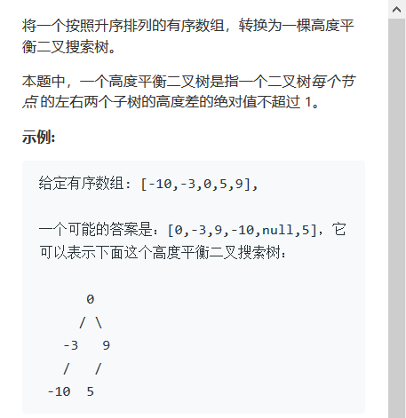

# 513. Find Bottom Left Tree Value


###  题目





## 分析

* 输入：一棵二叉树
* 输出：最底层的最靠左的节点的值
* 解题思路：
* dfs：设置maxDepth,每次深搜到depth&gt;maxDepth时，更新maxDepth和结果res（即最底层的最左边节点的值），为保证该节点是最左边节点，需要先深搜左子树，再深搜右子树（这样左右深度相同时，只在左子树处更新，右子树处不会更新），保证了最左
* bfs：层次遍历，每到一层，记录最左值，到最后一层之后，没有层，此时记录值就是最后一层的最左节点的值。
* 此题采用bfs会更容易理解。

## 解法1：DFS

```c
/**
 * Definition for a binary tree node.
 * struct TreeNode {
 *     int val;
 *     TreeNode *left;
 *     TreeNode *right;
 *     TreeNode(int x) : val(x), left(NULL), right(NULL) {}
 * };
 */
class Solution {
public:
    int maxDepth=0;
    int findBottomLeftValue(TreeNode* root) {
        int res=0;
        dfs(root,1,res);
        return res;
    }
    void dfs(TreeNode *root,int depth,int &res){
        if(!root)
            return ;
        if(depth>maxDepth){
            maxDepth=depth;
            res=root->val;
        }
        dfs(root->left,depth+1,res);
        dfs(root->right,depth+1,res);
    }
};
```

## 解法2：BFS

```c
/**
 * Definition for a binary tree node.
 * struct TreeNode {
 *     int val;
 *     TreeNode *left;
 *     TreeNode *right;
 *     TreeNode(int x) : val(x), left(NULL), right(NULL) {}
 * };
 */
class Solution {
public:
    int maxDepth=0;
    int findBottomLeftValue(TreeNode* root) {
        queue<TreeNode *> levelNodes;
        int res=root->val;
        levelNodes.push(root);
        while(!levelNodes.empty()){
            int levelLen=levelNodes.size();
            res=levelNodes.front()->val;
            for(int i=0;i<levelLen;i++){
                TreeNode *node=levelNodes.front();
                levelNodes.pop();
                if(node->left)
                    levelNodes.push(node->left);
                if(node->right)
                    levelNodes.push(node->right);
            }
        }
        return res;
    }

};
```

